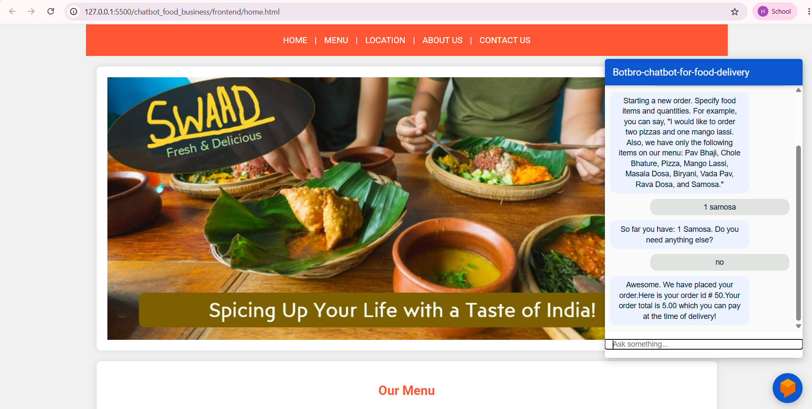
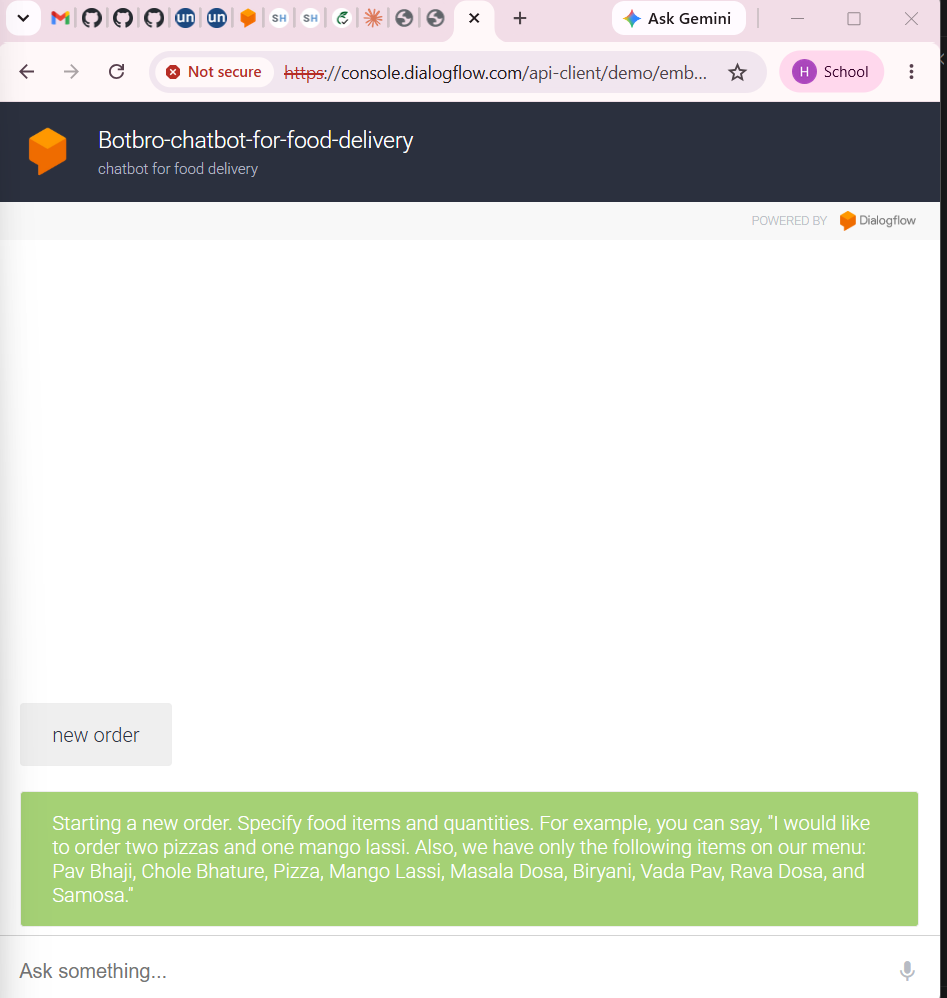

#  Swaad - AI Food Ordering Chatbot

An intelligent food ordering chatbot built using **Google Dialogflow ES**, **FastAPI**, **Python**, **MySQL**, and a responsive **HTML/CSS** frontend.

The chatbot enables users to place food orders, modify existing orders, track order status, and interact naturally using conversational AI. The backend is powered by FastAPI and integrated with Dialogflow ES through webhook fulfillment.

---

##  Features

-  AI-powered chatbot using Google Dialogflow ES
-  Start a new food order
-  Add food items to an existing order
-  Remove food items from an existing order
-  Complete and place an order
-  Track order status using Order ID
-  Automatic bill calculation
-  Generates unique Order IDs
-  Stores order information in MySQL
-  Responsive restaurant website
-  FastAPI webhook integration
-  Mobile-friendly chatbot interface

---

#  Tech Stack

### Frontend
- HTML5
- CSS3
- Dialogflow Messenger

### Backend
- Python
- FastAPI

### AI Platform
- Google Dialogflow ES

### Database
- MySQL

### Development Tools
- VS Code
- ngrok
- MySQL Workbench

---

#  Chatbot Intents

| Intent | Description |
|---------|-------------|
| Default Welcome Intent | Welcomes the user |
| new.order | Starts a new food order |
| order.add | Adds food items to the current order |
| order.remove | Removes food items from the current order |
| order.complete | Places the order and generates an Order ID |
| track.order | Starts order tracking |
| track.order (ongoing-tracking) | Retrieves the current order status |

---

#  Sample Conversation

###  New Order

```
User: New Order

Bot:
Starting a new order.
Specify food items and quantities.

User:
2 pizzas

Bot:
Added 2 Pizza.
Anything else?

User:
1 Mango Lassi

Bot:
Added 1 Mango Lassi.
Anything else?

User:
No

Bot:
Your order has been placed successfully.
Order ID: #50
Total Bill: ₹550
```

---

###  Track Order

```
User:
Track Order

Bot:
Please enter your Order ID.

User:
50

Bot:
Order #50 is currently In Transit.
```

---

#  System Architecture

```
                    Customer

                       │

                       ▼

         Restaurant Website (HTML/CSS)

                       │

                       ▼

            Dialogflow Messenger Widget

                       │

                       ▼

               Google Dialogflow ES

                       │

                 Webhook Request

                       │

                       ▼

                 FastAPI Backend

                       │

                       ▼

                 MySQL Database
```

---

#  Project Structure

```
chatbot_food_business/

│
├── backend/
│   ├── main.py
│   ├── db_helper.py
│   ├── generic_helper.py
│   ├── requirements.txt
│   └── ...
│
├── frontend/
│   ├── home.html
│   ├── styles.css
│   ├── banner.jpg
│   ├── menu1.jpg
│   ├── menu2.jpg
│   ├── menu3.jpg
│   └── ...
│
├── db/
│   └── restaurant_eatery.sql
│
├── dialogflow_assets/
│
├── screenshots/
│
├── README.md
│
└── .gitignore
```

---

#  Installation

## 1. Clone the Repository

```bash
git clone https://github.com/<your-username>/chatbot_food_business.git

cd chatbot_food_business
```

---

## 2. Install Python Dependencies

```bash
cd backend

pip install -r requirements.txt
```

---

## 3. Configure MySQL

Import

```
db/restaurant_eatery.sql
```

using **MySQL Workbench**.

Update the database credentials inside

```
backend/db_helper.py
```

according to your local MySQL configuration.

---

## 4. Start the FastAPI Backend

```bash
cd backend

uvicorn main:app --reload
```

The backend will start at

```
http://localhost:8000
```

---

#  Expose the Backend using ngrok

Dialogflow ES requires an **HTTPS** webhook.

Since the FastAPI server runs locally, use **ngrok** to expose it.

---

## Step 1: Download ngrok

Download from

https://ngrok.com/download

Extract the executable and place it in a convenient folder.

---

## Step 2: Start ngrok

Open a **new terminal** and run

```bash
ngrok http 8000
```

You will receive an output similar to

```
Forwarding

https://abc123.ngrok-free.app
            │
            ▼
http://localhost:8000
```

Copy the generated HTTPS URL.

---

## Step 3: Update Dialogflow Webhook

Open your Dialogflow ES Agent

```
Fulfillment
```

Replace the existing webhook URL with

```
https://abc123.ngrok-free.app
```

Click **Save**.

---

## Important Notes

- The free ngrok URL changes every time ngrok is restarted.
- Update the webhook URL whenever the ngrok URL changes.
- Keep both **FastAPI** and **ngrok** running while testing.

---

#  Run the Frontend

Open the project using **VS Code Live Server**.

or

```bash
cd frontend

python -m http.server 5500
```

Visit

```
http://127.0.0.1:5500/home.html
```

---

#  Screenshots

## Home Page



---

## Chatbot Interface



---

```markdown
## Dialogflow context


```

---

#  Future Enhancements

-  Online Payment Gateway
-  User Authentication
-  Order History
-  Customer Reviews
-  Live Delivery Tracking
-  Admin Dashboard
-  LLM-powered fallback responses

---

#  Author

**Himank Singh**

M.Tech (Artificial Intelligence & Data Science)

Indian Institute of Information Technology (IIIT) Kota

---